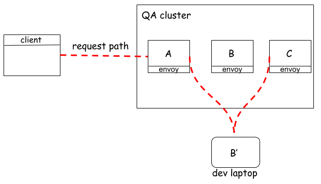

# Devrouter demo

## Prerequisites

* Vagrant
* VirtualBox
* docker

## Goal

In this demo we will see how an `EnvoyFilter` can be used to dynamically 
reroute requests from the mesh to anywhere you want, provided you have network
connectivity. For more context please refer to our blog post -- [Your laptop as part of the 
mesh](https://medium.com/omio-engineering/your-laptop-as-part-of-the-service-mesh-bd3929dab959).

Let's say we want to run an end-to-end test involving 3 services: `A`, `B`, `C`. These services
are running on a k8s cluster (vagrant VM) that we are going to call `QA`. When service `A` is called, 
it triggers a chain of call up to `C`, i.e.: `A` calls `B` and `B` calls `C`. Let's suppose we are adding a new 
feature to service `B` and we would like to run an end-to-end test without hitting `B` on `QA`, but 
`B` running locally on our laptop. The following diagram illustrates what we want to achieve: 

## Running the demo

For simplification purposes, we won't be running `A`,`B` and `C` services in the cluster. 
We will just run `B` (an `echo-server`) and make requests with and without the `devroute` contract to showcase
how an `EnvoyFilter` can be used to dynamically reroute requests. Also, all requests will be made 
from within our vagrant box. This box will be running a kubernetes cluster managed by `minikube`. Think about the vagrant box to be your laptop and `minikube` the `QA` cluster. 

For any `vagrant` command that we'll execute, make sure you do it from this folder, so `vagrant` 
has access to `Vagrantfile`. 

We are going to need to open 3 tabs on our terminal, each with the current directory pointing to this 
directory.

### First tab

Let's bring up our Kubernetes cluster:

`vagrant up`

this command needs to finish to ensure that our cluster is fully setup with all dependencies.

We will be running this demo from inside the vagrant VM, so let's ssh into it first:

`vagrant ssh`

Let's run an instance of B locally:

`docker run -it -p 8001:80 kennethreitz/httpbin:latest gunicorn --access-logfile - -b 0.0.0.0:80 httpbin:app`

the access logs will help us identify which B is getting hit after we make a request. 

### Second tab

SSH into the box:

`vagrant ssh`

We will tail the logs of the pod running B. The logs will show the access logs of our echo service,

`k logs -f -n echo-server -l app=echo-server -c echo-server`

### Third tab

SSH into the box:

`vagrant ssh`

We are now going to see devroute contract in action. 

First, we will make a request to `echo-server` running in kubernetes:

`curl http://$(minikube ip):30111/get`

Check _Second tab_ for any access logs showing up. You should see the request you just made.
This request went directly to the pod because the `devroute` header was not present.

Let's now make another request, but this time it will be rerouted to our docker instance 
running in _First tab_.

`curl -H "x-devroute: {\"echo-server\":\"$(minikube ip):8001\"}" http://$(minikube ip):30111/get`

Despite that we are making this call to `echo-server` running in kubernetes, the presence of the 
`devroute` header made our `envoyfilter` reroute the request to our `devrouter` proxy, which in turns, 
proxied the request to `echo-server` running in docker. To convince yourself, check the logs from 
the _First tab_ running docker.

I hope this demo can give you inspiration to implement other cool things with `EnvoyFilter`.

Enjoy !

